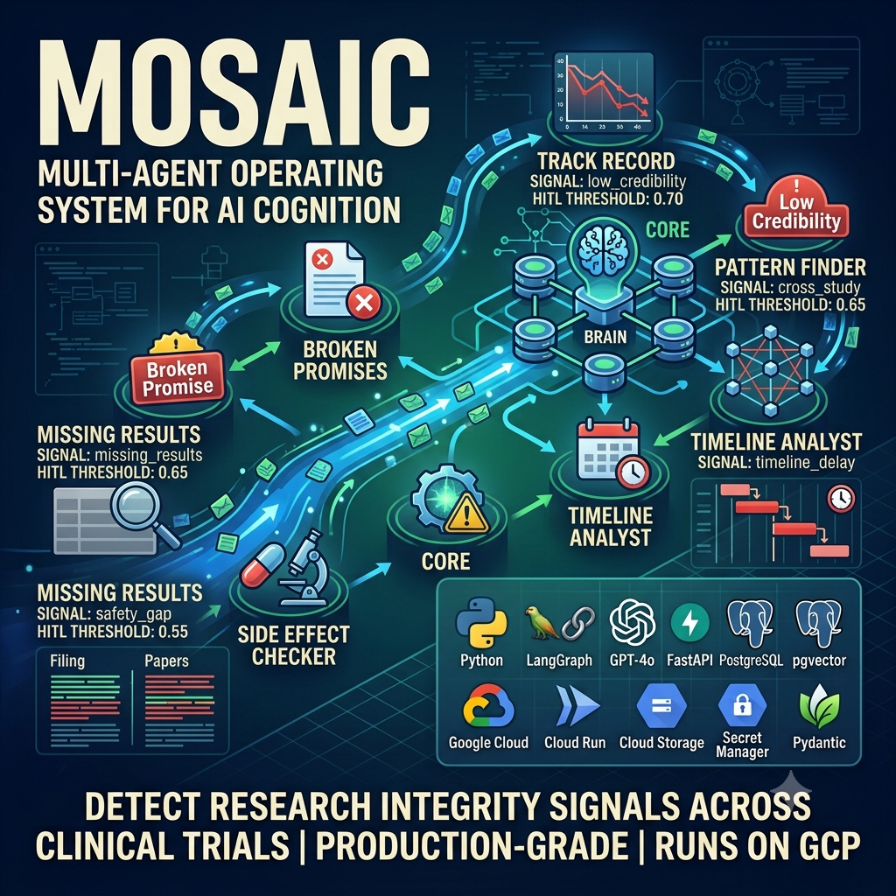
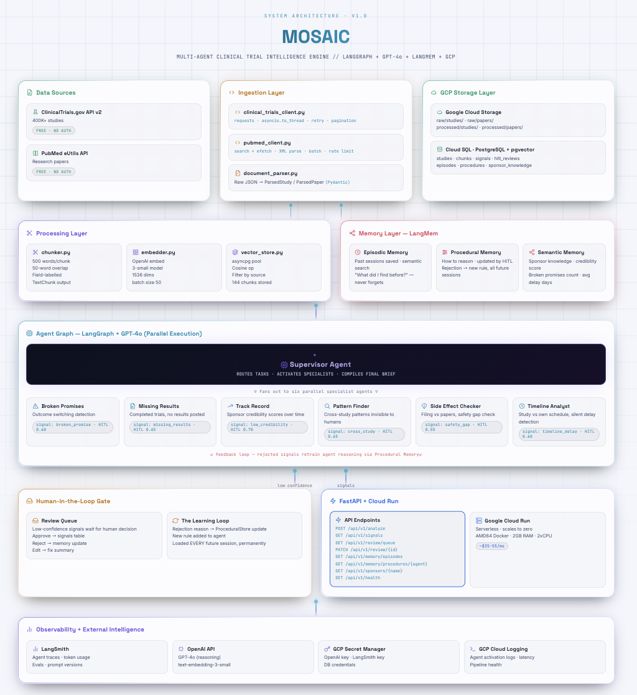

# MOSAIC — Multi-Agent Clinical Trial Intelligence System



> A production-grade multi-agent AI system that detects research integrity
> signals across clinical trials using 6 specialist agents running in parallel
> on Google Cloud Platform.

[](https://python.org)
[](https://fastapi.tiangolo.com)
[](https://langchain-ai.github.io/langgraph)
[](https://cloud.google.com/run)

---

## 📖 Table of Contents

- [Project Description](#-project-description)
- [Demo](#-demo)
- [Features](#-features)
- [Tech Stack](#-tech-stack)
- [Architecture](#-architecture)
- [Project Structure](#-project-structure)
- [Getting Started](#-getting-started)
- [Environment Variables](#-environment-variables)
- [Usage](#-usage)
- [API Documentation](#-api-documentation)
- [Deployment](#-deployment)
- [Troubleshooting](#-troubleshooting)
- [Roadmap](#-roadmap)
- [License](#-license)
- [Contact](#-contact)

---

## 📌 Project Description

MOSAIC (Multi-Agent Operating System for AI Cognition) is a production
multi-agent AI system that ingests clinical trial data from ClinicalTrials.gov
and PubMed, reasons across studies simultaneously, detects research integrity
signals, and exposes a FastAPI REST layer — deployed on Google Cloud Run.

**The problem it solves:**
About 30% of completed clinical trials never publish their results. Outcome
switching, timeline delays, and safety discrepancies are buried across
400,000+ government records that no single human can read simultaneously.
MOSAIC reads all of them at once and surfaces what humans miss.

**What makes it different:**

- 6 specialist agents run **in parallel** — not sequentially
- **Three types of memory** — episodic, procedural, semantic
- **Learns from human feedback** — rejections update agent reasoning permanently
- **Production deployed** on GCP for under $55/month

---

## 🎬 Demo

```bash
# Run a live analysis against production
curl -s -X POST \
  -H "Authorization: Bearer $(gcloud auth print-identity-token)" \
  -H "Content-Type: application/json" \
  -d '{"task": "Find completed clinical trials where results were never posted", "max_studies": 3}' \
  https://mosaic-api-569957100480.us-central1.run.app/api/v1/analyze | python3 -m json.tool
```

**Sample response:**

```json
{
  "run_id": "a5712262-7b94-4bfc-9d46-6861000681fe",
  "task": "Find completed clinical trials where results were never posted",
  "final_brief": "Three completed clinical trials identified with results overdue by several years...",
  "total_signals": 3,
  "signals_requiring_review": 0,
  "agents_activated": ["missing_results_agent", "track_record_agent"],
  "duration_seconds": 15.24
}
```

---

## ✨ Features

### 6 Specialist Agents Running in Parallel

| Agent               | What it detects                                                           |
| ------------------- | ------------------------------------------------------------------------- |
| Missing Results     | Completed trials with no results posted (legal violation after 12 months) |
| Broken Promises     | Outcome switching — goals changed mid-study                              |
| Track Record        | Sponsor credibility scores built over time                                |
| Pattern Finder      | Cross-study patterns invisible to single-study readers                    |
| Side Effect Checker | Safety gaps between official filings and published papers                 |
| Timeline Analyst    | Silent delays past completion date with no explanation                    |

### Three-Layer Memory System

- **Episodic** — agents remember what they found in past sessions
- **Procedural** — agents learn from human corrections permanently
- **Semantic** — sponsor knowledge base grows with every analysis run

### Human-in-the-Loop Gate

- Low confidence signals → human review queue
- Rejections → written to procedural memory → agent reasons differently forever
- One correction changes agent behaviour in ALL future sessions

### Production Infrastructure

- Serverless on Cloud Run — scales to zero, costs nothing when idle
- PostgreSQL + pgvector — semantic search over 1536-dimensional embeddings
- 9 REST endpoints with FastAPI + auto-generated Swagger docs

---

## 🛠 Tech Stack

| Layer           | Technology                                     |
| --------------- | ---------------------------------------------- |
| Language        | Python 3.12 async                              |
| Agent Framework | LangGraph 0.2.6                                |
| LLM             | GPT-4o (reasoning)                             |
| Embeddings      | OpenAI text-embedding-3-small (1536 dims)      |
| API             | FastAPI + Uvicorn                              |
| Database        | PostgreSQL 15 + pgvector (Cloud SQL)           |
| Vector Search   | pgvector hnsw index                            |
| File Storage    | Google Cloud Storage                           |
| Deployment      | Google Cloud Run                               |
| Secrets         | GCP Secret Manager                             |
| HTTP Clients    | requests (ClinicalTrials.gov) + httpx (PubMed) |
| Retry Logic     | tenacity                                       |
| Validation      | Pydantic v2                                    |

---

## 🏗 Architecture

<a href="https://PriyankWebpage.github.io/Projects/DL/MOSAIC — Multi-Agent Clinical Trial Intelligence RAG Engine
/Images/mosaic_architecture.html" target="_blank">👉 Link to Interactive Architecture Diagram</a>



**DATA SOURCES**

**├**── ClinicalTrials.gov API v2  **  (400K+ studies, free, no **auth)

**└── PubMed eUtils API **           (research papers, **free, no auth)**

**↓**

**ING**ESTION LAYER

**├── **clinical_trials_client.py    (async, **rate limited, retry)**

**├── **pubmed_client.py             (esearch → **efetch, XML parse)**

**├── **document_parser.py           (raw JSON **→ Pydantic models)**

**└── **gcs_store.py                 (save raw **+ processed to GCS)**

**    ↓**

**PROCESSING LAYER**

**├── **chunker.py                   **(500-word chunks, 50-word **overlap)

**├── embedder.py            **      (OpenAI, batch 50, **1536 dims)**

**└── vector_store.py **             (asyncpg + **pgvector cosine search)**

**↓**

**MEMORY LAYER (LangMem)**

**├── **episodic_store.py            (past **sessions, semantic search)**

**├── **procedural_store.py          (reasoning **rules + HITL learning)**

**└── **semantic_store.py            (sponsor **credibility profiles)**

**↓**

**AGENT **GRAPH (LangGraph + GPT-4o — **PARALLEL EXECUTION)**

**├── **Supervisor                   **(routes + compiles brief)**

**├── **Missing Results Agent        **(threshold 0.65)**

**├── Broken **Promises Agent        (threshold **0.60)**

**├── Track Record Agent **          (threshold 0.70)

**├─**─ Pattern Finder Agent    **     (threshold 0.65)**

**├── Side **Effect Checker          **(threshold 0.55)**

**└── Timeline **Analyst             (threshold **0.60)**

**↓**

**HITL GATE**

**├── High confidence → **signals table (direct save)

**└──** Low confidence → **review queue → human decision → **procedural memory

**↓**

**FAS**TAPI (9 endpoints) → **GOOGLE CLOUD RUN**

## 📁 Project Structure

**mosaic/**

**│**

**├── config/**

**│**   ├── settings.py        **      # Pydantic **BaseSettings, all env vars

**│   └── **logging_config.py        # **Centralised logging setup**

**│**

**├── **ingestion/

**│   ├── **clinical_trials_client.py

**│   ├── **pubmed_client.py

**│   ├── **document_parser.py

**│   ├── gcs_store.py**

**│   └── run_ingestion.py     **    # Entry point — run **this first**

**│**

**├── processing/**

**│   ├── chunker.py**

**│  ** ├── embedder.py

**│   **├── vector_store.py

**│   **└── run_processing.py    **    # Entry point — run **this second

**│**

**├── memory/**

**│  ** ├── episodic_store.py

**│   ├── **procedural_store.py

**│   └── **semantic_store.py

**│**

**├── agents/**

**│   ├── **supervisor.py

**│   ├── **broken_promises_agent.py

**│   ├── **missing_results_agent.py

**│   ├── **track_record_agent.py

**│   ├── **pattern_finder_agent.py

**│   ├── **side_effect_agent.py

**│   └── **timeline_agent.py

**│**

**├── tools/**

**│   ├── **search_tools.py          # 8 database + **memory tools**

**│   ├── clinical_tools.py  **      # 4 live ClinicalTrials.gov tools

**│   └── pubmed_tools.py          # 3 **live PubMed tools

**│**

**├── graph/**

**│   ├── **state.py                 # MosaicState **TypedDict**

**│   ├── graph_builder.py      **   # Wires all agents into LangGraph

**│  ** └── hitl.py                  # HITL **gate + learning loop**

**│**

**├── api/**

**│   ├── **main.py                  # FastAPI app **+ lifespan**

**│   ├── schemas.py    **           # All Pydantic **request/response models**

**│   ├── **dependencies.py          # Shared **resource singletons**

**│   └── routers/**

**│  **     ├── analysis.py          # POST **/api/v1/analyze**

**│       ├── signals.py  **         # GET /api/v1/signals

**│       **├── review.py            # GET + PATCH **/api/v1/review**

**│       └── memory.py    **        # GET /api/v1/memory + **/sponsors**

**│**

**├── deployment/**

**│   ├── **Dockerfile               # Multi-stage, **AMD64**

**│   ├── .dockerignore**

**│   └── **gcp/

**│       ├── cloudsql_init.sql    # **Schema — run once after Cloud SQL setup

**│       └── deploy.sh            # **Full GCP deployment script

**│**

**├── **.env.example                 # **Template — copy to .env and fill in**

**├── **.gitignore

**├── pyproject.toml           **    # pip install -e . for clean **imports**

**├── requirements.txt**

**└── **README.md

---

## 🚀 Getting Started

### Prerequisites

- Python 3.12+
- Docker Desktop (for deployment)
- Google Cloud account with billing enabled
- OpenAI API key

### 1. Clone the repository

```bash
git clone https://github.com/YOUR_USERNAME/mosaic.git
cd mosaic
```

### 2. Create virtual environment

```bash
python3 -m venv .venv
source .venv/bin/activate
```

### 3. Install dependencies

```bash
pip install -r requirements.txt
pip install -e .
```

### 4. Set up GCP infrastructure

```bash
# Authenticate
gcloud auth login
gcloud auth application-default login
gcloud config set project YOUR_PROJECT_ID

# Enable APIs
gcloud services enable sqladmin.googleapis.com storage.googleapis.com run.googleapis.com secretmanager.googleapis.com --project=YOUR_PROJECT_ID

# Create Cloud Storage bucket
gsutil mb -p YOUR_PROJECT_ID -l us-central1 gs://YOUR_BUCKET_NAME

# Create Cloud SQL instance
gcloud sql instances create clinical-trial-db \
  --database-version=POSTGRES_15 \
  --tier=db-f1-micro \
  --zone=us-central1-f \
  --project=YOUR_PROJECT_ID

# Create database and user
gcloud sql databases create clinical_trial_db --instance=clinical-trial-db
gcloud sql users create mosaic_user --instance=clinical-trial-db --password=YOUR_PASSWORD
```

### 5. Create the database schema

```bash
# Whitelist your IP first
curl -4 ifconfig.me  # copy this IP

gcloud sql instances patch clinical-trial-db \
  --authorized-networks=YOUR_IP/32 \
  --project=YOUR_PROJECT_ID

# Connect and run schema
psql "host=YOUR_SQL_IP port=5432 dbname=clinical_trial_db user=mosaic_user"
```

Then paste the contents of `deployment/gcp/cloudsql_init.sql`.

### 6. Configure environment variables

```bash
cp .env.example .env
# Fill in all values — see Environment Variables section below
```

### 7. Run ingestion pipeline

```bash
python3 ingestion/run_ingestion.py
# Downloads studies from ClinicalTrials.gov and PubMed → saves to GCS
# Expected: ~5-10 minutes for 150 studies
```

### 8. Run processing pipeline

```bash
python3 processing/run_processing.py
# Chunks studies, generates embeddings, saves to Cloud SQL
# Expected: ~3-5 minutes, costs ~$0.001 in OpenAI API calls
```

### 9. Run the API locally

```bash
uvicorn api.main:app --host 0.0.0.0 --port 8000 --reload
# Open http://localhost:8000/docs for Swagger UI
```

---

## 🔐 Environment Variables

Copy `.env.example` to `.env` and fill in all values:

```env
# OpenAI
OPENAI_API_KEY=sk-...
OPENAI_EMBEDDING_MODEL=text-embedding-3-small
OPENAI_CHAT_MODEL=gpt-4o

# GCP
GCP_PROJECT_ID=your-project-id
GCP_REGION=us-central1
GCS_BUCKET_NAME=your-bucket-name

# Cloud SQL
DB_HOST=34.XXX.XXX.XXX          # Public IP for local dev
DB_PORT=5432
DB_NAME=clinical_trial_db
DB_USER=mosaic_user
DB_PASSWORD=your-password

# API
API_HOST=0.0.0.0
API_PORT=8000
API_ENV=development
```

> **Never commit `.env` to git.** It is in `.gitignore` by default.

---

## 📡 Usage

### Run an analysis

```bash
curl -s -X POST \
  -H "Content-Type: application/json" \
  -d '{"task": "Find completed trials with missing results", "max_studies": 5}' \
  http://localhost:8000/api/v1/analyze | python3 -m json.tool
```

### Check the review queue

```bash
curl -s http://localhost:8000/api/v1/review/queue | python3 -m json.tool
```

### Submit a human review decision

```bash
curl -s -X PATCH \
  -H "Content-Type: application/json" \
  -d '{"decision": "reject", "reviewer": "analyst@company.com", "rejection_reason": "Trial was terminated early — exempt from posting requirement"}' \
  http://localhost:8000/api/v1/review/QUEUE_ID_HERE | python3 -m json.tool
```

### Search agent memory

```bash
curl -s "http://localhost:8000/api/v1/memory/episodes?query=missing+results+sponsor" | python3 -m json.tool
```

### View agent reasoning rules

```bash
curl -s http://localhost:8000/api/v1/memory/procedures/missing_results_agent | python3 -m json.tool
```

---

## 📚 API Documentation

| Method    | Endpoint                              | Description                           |
| --------- | ------------------------------------- | ------------------------------------- |
| `POST`  | `/api/v1/analyze`                   | Trigger full analysis run             |
| `GET`   | `/api/v1/signals`                   | List all generated signals            |
| `GET`   | `/api/v1/signals/{id}`              | Get one signal by ID                  |
| `GET`   | `/api/v1/review/queue`              | Get pending human review items        |
| `PATCH` | `/api/v1/review/{id}`               | Submit approve/reject/edit decision   |
| `GET`   | `/api/v1/memory/episodes`           | Search past agent sessions            |
| `GET`   | `/api/v1/memory/procedures/{agent}` | Get agent reasoning rules             |
| `GET`   | `/api/v1/sponsors`                  | List all sponsor profiles             |
| `GET`   | `/api/v1/sponsors/{name}`           | Get one sponsor's credibility profile |
| `GET`   | `/api/v1/health`                    | System health check                   |

Full interactive documentation available at `/docs` (Swagger UI) when running locally.

---

## ☁️ Deployment

### Deploy to Google Cloud Run

```bash
# Make script executable (first time only)
chmod +x deployment/gcp/deploy.sh

# Run full deployment
./deployment/gcp/deploy.sh
```

Or run manually step by step:

```bash
# 1. Build and push image (AMD64 required for Cloud Run)
docker buildx build \
  --platform linux/amd64 \
  --tag gcr.io/YOUR_PROJECT_ID/mosaic-api:latest \
  --file deployment/Dockerfile \
  --push .

# 2. Deploy to Cloud Run
gcloud run deploy mosaic-api \
  --image=gcr.io/YOUR_PROJECT_ID/mosaic-api:latest \
  --platform=managed \
  --region=us-central1 \
  --memory=2Gi \
  --cpu=2 \
  --port=8000 \
  --project=YOUR_PROJECT_ID
```

### Cost breakdown

| Service         | Running                                          | Idle (SQL stopped) |
| --------------- | ------------------------------------------------ | ------------------ |
| Cloud Run       | ~$3-8/month | $0 (scales to zero)                |                    |
| Cloud SQL       | ~$15-18/month | ~$0.50/month                     |                    |
| Cloud Storage   | ~$0.03/month | ~$0.03/month                      |                    |
| OpenAI API      | ~$15-25/month | $0                               |                    |
| **Total** | **~$35-55/month** | **~$0.53/month** |                    |

### Stop Cloud SQL when not in use

```bash
gcloud sql instances patch clinical-trial-db \
  --activation-policy=NEVER \
  --project=YOUR_PROJECT_ID
```

---


## 🗺 Roadmap

- [ ] Add evaluation layer with LangSmith evals
- [ ] Build a Streamlit dashboard for signal review
- [ ] Add FDA adverse event database as a third data source
- [ ] Implement scheduled runs via Cloud Scheduler
- [ ] Add email alerts when high-confidence signals are generated
- [ ] Build sponsor comparison feature across multiple organisations
- [ ] Add support for international trial registries (EudraCT, ISRCTN)
- [ ] Implement fine-tuned embedding model for clinical domain

